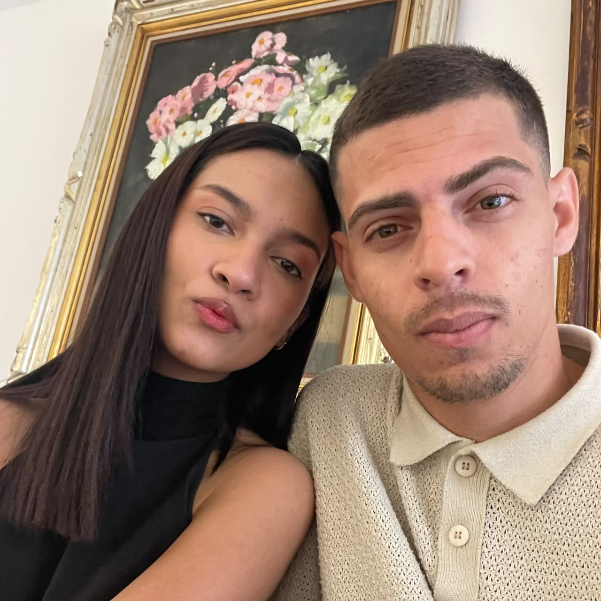

# 0zzySeer.github.io
Site de casamento — Osiel &amp; Danielle
/**
 * OSIEL & DANIELLE — RSVP
 *
 * 1. Crie/abra a planilha onde deseja receber as confirmações.
 * 2. Extensões > Apps Script.
 * 3. Cole este arquivo no editor.
 * 4. Ajuste SPREADSHEET_ID e SHEET_NAME.
 * 5. Implante como aplicativo da Web:
 *    - Executar como: você
 *    - Quem tem acesso: qualquer pessoa
 * 6. Copie a URL /exec para RSVP_ENDPOINT no index-rsvp-custom.html.
 */

const SPREADSHEET_ID = "COLE_AQUI_O_ID_DA_PLANILHA";
const SHEET_NAME = "RSVP";

function doPost(e) {
  try {
    const p = e && e.parameter ? e.parameter : {};
    const ss = SpreadsheetApp.openById(SPREADSHEET_ID);
    const sheet = ss.getSheetByName(SHEET_NAME) || ss.insertSheet(SHEET_NAME);

    if (sheet.getLastRow() === 0) {
      sheet.appendRow(["Data/hora", "Nome", "Presença", "Mensagem", "Origem", "Data do evento"]);
    }

    sheet.appendRow([
      new Date(),
      p.nome || "",
      p.presenca || "",
      p.mensagem || "",
      p.origem || "site",
      p.data_evento || "14 de novembro de 2026"
    ]);

    return ContentService
      .createTextOutput(JSON.stringify({ ok: true }))
      .setMimeType(ContentService.MimeType.JSON);
  } catch (err) {
    return ContentService
      .createTextOutput(JSON.stringify({ ok: false, error: String(err) }))
      .setMimeType(ContentService.MimeType.JSON);
  }
}

<!DOCTYPE html>
<html lang="pt-BR">
<head>
<meta charset="UTF-8">
<meta name="viewport" content="width=device-width, initial-scale=1.0">
<title>Osiel & Danielle — 14.11.2026</title>
<link rel="preconnect" href="https://fonts.googleapis.com">
<link rel="preconnect" href="https://fonts.gstatic.com" crossorigin>
<link href="https://fonts.googleapis.com/css2?family=Cormorant+Garamond:wght@400;500;600&family=Montserrat:wght@300;400;500;600&family=Parisienne&display=swap" rel="stylesheet">

</head>
<body>

<header class="hero" id="inicio">

<nav class="nav">

♡

<a href="#inicio">Início</a><a href="#historia">Nossa história</a><a href="#detalhes">Detalhes</a><a href="#presentes">Presentes</a><a href="#rsvp">Confirme sua presença</a>

♡

</nav>

Nosso grande dia

<h1 class="names">Osiel & Danielle</h1>

14 DE NOVEMBRO DE 2026

♡

Vamos celebrar o amor que nos trouxe até aqui e que nos leva a um futuro juntos.

<a class="outline-btn" href="#rsvp">Confirmar presença →</a>

</header>

<section class="paper" id="historia">
<svg class="floral left" viewBox="0 0 250 340"><path class="stem" d="M20 330 C55 260 105 190 205 30"/><ellipse class="leaffill" cx="60" cy="250" rx="34" ry="12" transform="rotate(-48 60 250)"/><ellipse class="leaffill" cx="86" cy="207" rx="33" ry="12" transform="rotate(-38 86 207)"/><ellipse class="leaffill" cx="119" cy="158" rx="34" ry="12" transform="rotate(-37 119 158)"/><ellipse class="leaffill" cx="151" cy="108" rx="30" ry="11" transform="rotate(-36 151 108)"/><ellipse class="leaffill" cx="77" cy="274" rx="32" ry="12" transform="rotate(24 77 274)"/><ellipse class="leaffill" cx="108" cy="220" rx="31" ry="11" transform="rotate(22 108 220)"/><ellipse class="leaffill" cx="145" cy="167" rx="31" ry="11" transform="rotate(21 145 167)"/></svg>
<svg class="floral right" viewBox="0 0 250 340"><path class="stem" d="M20 330 C55 260 105 190 205 30"/><ellipse class="leaffill" cx="60" cy="250" rx="34" ry="12" transform="rotate(-48 60 250)"/><ellipse class="leaffill" cx="86" cy="207" rx="33" ry="12" transform="rotate(-38 86 207)"/><ellipse class="leaffill" cx="119" cy="158" rx="34" ry="12" transform="rotate(-37 119 158)"/><ellipse class="leaffill" cx="151" cy="108" rx="30" ry="11" transform="rotate(-36 151 108)"/></svg>

Sobre nós
<h2 class="section-title script">Osiel & Danielle</h2>

♡

Duas histórias, um só propósito: construir uma vida juntos, com amor, respeito e muitos sonhos para viver.

14

Novembro

2026

Nosso grande dia

</section>

<section class="paper" style="padding-top:20px;padding-bottom:100px">

  

    
  

Nossa história
<h3>O começo de uma nova fase</h3>
Um amor construído com carinho, companheirismo e muitos sonhos. Agora, Osiel & Danielle se preparam para celebrar esse novo capítulo ao lado das pessoas que fazem parte da nossa história.

Queremos guardar este dia para sempre e compartilhar cada momento com quem amamos.

♡

</section>

<section class="verse-section">
  
✦

  
Uma palavra para o nosso dia

  
“

  <blockquote>
    Para que todos vejam, e saibam, e considerem, e juntamente entendam
    que a mão do Senhor fez isto, e o Santo de Israel o criou.
  </blockquote>
  
Isaías 41:20

  
♡

</section>

<section class="dark" id="detalhes">

Reserve a data
<h2 class="section-title">Cerimônia & celebração</h2>
Tudo preparado com carinho para receber vocês no nosso grande dia.

<svg class="church-svg" viewBox="0 0 64 64" aria-hidden="true">
<path d="M30 7h4v9h9v4h-9v10h15v25H15V30h15V20h-9v-4h9V7Z" fill="none" stroke="currentColor" stroke-width="2.2" stroke-linejoin="round"/>
<path d="M10 55h44M22 55V39h8v16m12 0V39h-8v16M8 30l24-15 24 15" fill="none" stroke="currentColor" stroke-width="2.2" stroke-linejoin="round"/>
</svg>
<h3>Cerimônia</h3>
<strong>AD Belém - Conjunto Mauro Marcondes (Setor 14)</strong> R. Hilário Baldo, 214-342 Conj. Mauro Marcondes, Campinas - SP CEP 13057-421
<a class="map-btn" target="_blank" href="https://www.google.com/maps/search/?api=1&query=R.%20Hil%C3%A1rio%20Baldo%2C%20214-342%2C%20Campinas%20-%20SP%2C%2013057-421">Abrir no mapa</a>

♡
<h3>Nosso casamento</h3>
14 de novembro de 2026  <strong>19h</strong> Estamos preparando tudo para que seja um dia inesquecível.

</section>

<section class="dark" id="presentes" style="padding-top:25px">

Com carinho
<h2 class="section-title">Nossos presentes</h2>
♡

Se você deseja nos presentear, fique à vontade para escolher um item da nossa lista. Sua presença já é o maior presente!

✈
<h3>Lua de mel</h3>
Uma contribuição para vivermos momentos inesquecíveis.

R$ 150
<button onclick="openPix('Lua de mel','R$ 150')">Presentear</button>

⌂
<h3>Nosso novo lar</h3>
Ajude a construir o nosso cantinho.

R$ 250
<button onclick="openPix('Nosso novo lar','R$ 250')">Presentear</button>

♡
<h3>Jantar romântico</h3>
Uma noite especial para celebrar o nosso amor.

R$ 100
<button onclick="openPix('Jantar romântico','R$ 100')">Presentear</button>

<svg class="gift-svg" viewBox="0 0 64 64" aria-hidden="true">
  <path d="M15 29h34v3H15z" fill="none" stroke="currentColor" stroke-width="2.3"/>
  <path d="M19 32h26v15H19z" fill="none" stroke="currentColor" stroke-width="2.3"/>
  <path d="M14 29c0-4 4-6 9-6 4 0 7 2 9 4 2-2 5-4 9-4 5 0 9 2 9 6" fill="none" stroke="currentColor" stroke-width="2.3" stroke-linecap="round"/>
  <path d="M32 23v24" fill="none" stroke="currentColor" stroke-width="2.3"/>
  <path d="M32 23c-1-5-5-8-9-7 0 5 3 8 9 7ZM32 23c1-5 5-8 9-7 0 5-3 8-9 7Z" fill="none" stroke="currentColor" stroke-width="2.1" stroke-linejoin="round"/>
</svg>

<h3>Café da manhã</h3>
Um pequeno mimo para a nossa nova rotina.

R$ 70
<button onclick="openPix('Café da manhã','R$ 70')">Presentear</button>

◇
<h3>Presente especial</h3>
Uma lembrança escolhida com muito carinho.

R$ 200
<button onclick="openPix('Presente especial','R$ 200')">Presentear</button>

♡
<h3>Do seu jeito</h3>
Escolha o valor que deseja oferecer.

Valor livre
<button onclick="openPix('Presente do seu jeito','Valor livre')">Presentear</button>

</section>

<section class="timeline">

Nosso momento
<h2 class="section-title">Um dia especial</h2>

<h3>14 de novembro</h3>
O dia em que vamos celebrar o nosso amor junto das pessoas que fazem parte da nossa história.

<h3>Depois da cerimônia</h3>
Seguiremos juntos para celebrar, abraçar, sorrir e guardar novas memórias.

</section>

<section class="rsvp" id="rsvp">

Esperamos você
<h2 class="section-title script">Confirme sua presença</h2>

♡

Será uma alegria imensa ter você conosco nesse momento tão especial.

<form class="form" id="rsvpForm">
  <input type="text" name="nome" placeholder="Seu nome" autocomplete="name" required>
  <select name="presenca" required>
    <option value="" disabled selected>Você estará conosco?</option>
    <option value="Sim, estarei presente">Sim, estarei presente</option>
    <option value="Não poderei comparecer">Não poderei comparecer</option>
  </select>
  <textarea name="mensagem" placeholder="Deixe uma mensagem para os noivos (opcional)"></textarea>
  <button type="submit" id="rsvpSubmit">Confirmar presença</button>
  

</form>

Sua confirmação será enviada diretamente para a planilha configurada pelos noivos, sem exibir o Google Forms.

</section>

<footer>
Osiel & Danielle

14 DE NOVEMBRO DE 2026 · COM AMOR ♡
</footer>

<button class="close" onclick="closePix()">×</button>
Seu presente
<h2 class="modal-title" id="giftName"></h2>

Escaneie o QR Code PIX com o aplicativo do seu banco:

O QR Code não foi encontrado. Mantenha a pasta <strong>assets</strong> junto do index.html.

f92c1323-8af9-4a82-81ca-bfe412d67e8d
<button class="copy" onclick="copyPix()">Copiar chave PIX</button>

</body>
</html>
plugins = []
headers = []
redirects = []

[functions]

  [functions."*"]

[build]
publish = "/opt/build/repo"
publishOrigin = "default"

  [build.environment]

  [build.processing]

    [build.processing.css]

    [build.processing.html]

    [build.processing.images]

    [build.processing.js]

  [build.services]
SITE DE CASAMENTO — OSIEL & DANIELLE

Visual inspirado diretamente no modelo enviado: hero cinematográfico, paleta marrom/creme/dourado, tipografia de casamento, flores laterais, divisores, seções editoriais e cartões de presentes.

Dados:
Data: 14 de novembro de 2026
Local: AD Belém - Conjunto Mauro Marcondes (Setor 14)
Endereço: R. Hilário Baldo, 214-342 - Conj. Mauro Marcondes, Campinas - SP, 13057-421
PIX: f92c1323-8af9-4a82-81ca-bfe412d67e8d

Atenção: o formulário de RSVP é visual/demonstrativo. O site precisa de uma integração para armazenar respostas.

HERO: imagem cinematográfica com calendário, alianças e flores adicionada como fundo principal da abertura.

CORREÇÃO DO HERO: removida a imagem gerada que continha textos embutidos. O hero agora usa a foto original limpa como fundo, com os textos do site em uma única camada.

QR CODE: arquivo qrcode-pix.png incluído na pasta assets.
ÍCONE: ícone de igreja adicionado à seção da cerimônia.
